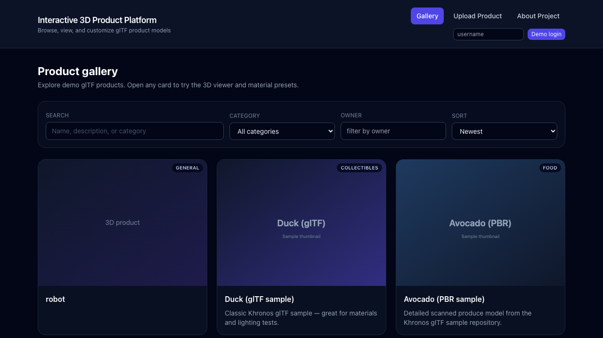

# Interactive 3D Product Platform

I built this project to practice end-to-end full-stack development for a 3D web product workflow.

The app lets users browse products, open and customize 3D models, upload new products, and manage product data through a backend API.

## Preview



## Stack

- Frontend: React, Vite, Tailwind CSS, Three.js, React Three Fiber, Drei
- Backend: FastAPI, SQLAlchemy, SQLite
- Storage: local files for uploaded models and thumbnails

## What it does

- Product gallery with search, category filter, owner filter, sorting, and pagination
- 3D model viewer for `.glb/.gltf` with orbit controls, lighting, loading state, and camera reset
- Real-time customization (color + material presets) with saved configurations
- Product upload with model file and optional thumbnail image (with preview)
- Product edit and delete from detail page
- Simple demo auth (`/auth/login`) with ownership checks on write actions

## API

Main endpoints:

- `POST /auth/login`
- `GET /products`
- `GET /products/{id}`
- `POST /products`
- `PUT /products/{id}`
- `DELETE /products/{id}`
- `GET /products/{id}/configurations`
- `POST /products/{id}/configurations`

## Run locally

### Backend

```bash
cd interactive-3d-product-platform/backend
python3 -m venv .venv
source .venv/bin/activate
pip install -r requirements.txt
uvicorn app.main:app --reload --host 127.0.0.1 --port 8000
```

### Frontend

```bash
cd interactive-3d-product-platform/frontend
npm install
cp .env.example .env.local
npm run dev
```

Frontend: `http://127.0.0.1:5173`  
Backend: `http://127.0.0.1:8000`

## Tests and checks

Backend:

```bash
cd backend
source .venv/bin/activate
pytest -q
```

Frontend:

```bash
cd frontend
npm run lint
npm run build
```

Optional e2e scaffold:

```bash
cd frontend
npm run test:e2e
```

## Docker (optional)

```bash
cd interactive-3d-product-platform
docker compose up --build
```
